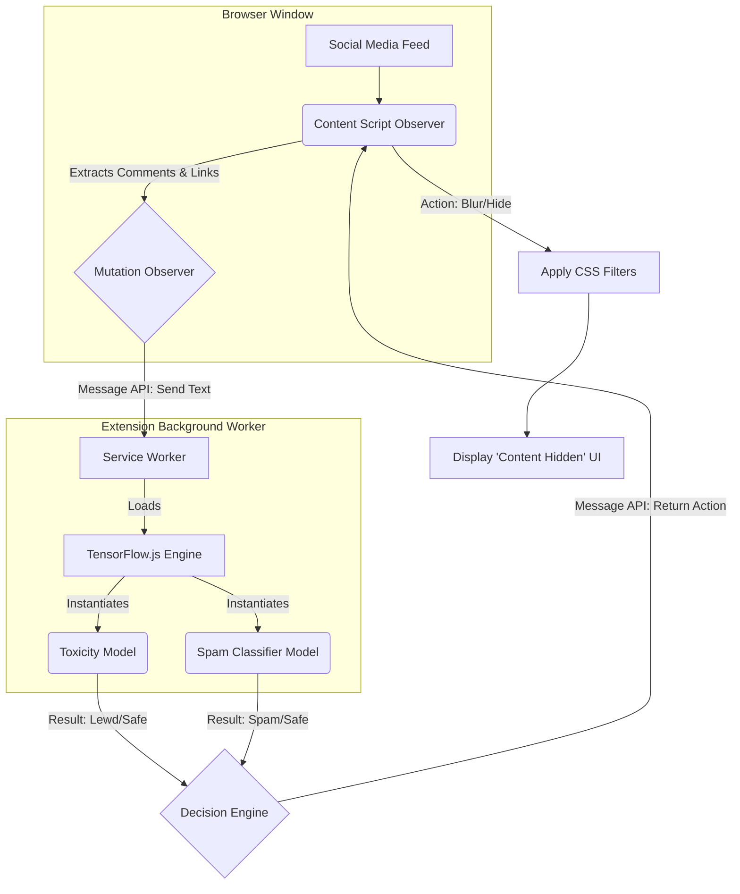

# PureShield: ML-Powered Social Media Filter


PureShield is a sophisticated Google Chrome extension designed to automatically filter out lewd comments and spam links across major social media platforms (YouTube, Twitter, Reddit, etc.). 

**Crucially, this extension relies entirely on Machine Learning (ML)** to make classification decisions, strictly avoiding fragile rule-based or keyword-matching systems. To ensure user privacy and minimize latency, all ML models run **client-side within the browser** using TensorFlow.js.

---

## 🧠 Machine Learning Architecture

The core philosophy of PureShield is 100% ML-driven moderation. The system uses two parallel models operating in the background service worker of the extension:

1. **Lewdness/Toxicity Detection (TensorFlow.js Pre-trained)**
   - **Model:** `tfjs-models/toxicity` (A lightweight MobileBERT architecture).
   - **Target Labels:** `sexual_explicit`, `obscene`, and `severe_toxicity`.
   - **Mechanism:** Text extracted from the DOM is converted into embeddings and classified. If the probability of lewdness exceeds a threshold (e.g., `0.85`), the content is flagged.

2. **Spam Link Classification (Custom Lightweight TF.js Model)**
   - **Model:** A custom-trained sequence model (1D CNN or small LSTM) exported to TensorFlow.js format.
   - **Target:** Classifies the text and link structure to identify obfuscated URLs, repetitive spam patterns, and bot-like behavior.
   - **Mechanism:** Takes text features (without relying on hardcoded blacklists) and predicts a binary `spam` vs. `safe` label.

---

## ⚙️ System Architecture

The extension uses the Manifest V3 architecture, strictly separating DOM manipulation from heavy ML computation.



---

## 🛠 Data Flow & Implementation Plan

### 1. The Content Script (`content.js`)
The content script is injected into supported URLs (e.g., `*://*.youtube.com/*`, `*://*.twitter.com/*`). 
- It uses a `MutationObserver` to watch for new comments being injected into the DOM as the user scrolls.
- It extracts the `innerText` and `href` attributes of the new nodes.
- It sends this raw data via `chrome.runtime.sendMessage` to the Background Service Worker.

### 2. The Service Worker (`background.js`)
- Initializes TensorFlow.js (`@tensorflow/tfjs`) when the browser starts.
- Loads the models from local extension storage to prevent redundant network requests.
- Listens for messages from the content script.
- Runs asynchronous inference (`model.classify([text])`).
- Returns a boolean flag `isUnsafe` and the specific `reason` back to the content script.

### 3. The Action layer
- If the background worker returns `isUnsafe: true`, the content script applies a CSS class to the specific DOM node (e.g., `filter: blur(8px)`).
- It overlays a non-intrusive button: *"This comment was hidden by PureShield (Spam). Click to reveal."*

---

## 🚀 Future Development Setup

### Prerequisites
- Node.js (v18+)
- npm or yarn
- Python 3.9+ (For training the custom Spam model)

### Planned Directory Structure
```text
project-K/
├── manifest.json
├── background.js       # TF.js initialization & messaging
├── content.js          # DOM Observer & UI changes
├── styles.css          # Blur and overlay UI styling
├── models/             # Directory for custom TF.js model weights
│   ├── spam_model.json
│   └── spam_weights.bin
├── src/                # (Optional) Webpack/Rollup entry points if using bundlers
└── README.md           # This document
```

### Next Steps for Implementation
1. **Initialize Project:** Setup `package.json` and install `@tensorflow/tfjs` and `@tensorflow-models/toxicity`.
2. **Train Spam Model:** Build a Python notebook using Keras to train a lightweight text classifier on a social media spam dataset, then export to `tfjs`.
3. **Develop Content Scripts:** Map out the specific DOM selectors for comments on YouTube, Twitter, and Reddit.
4. **Integration:** Connect the frontend DOM observers to the background TF.js inference engine.

---
*Disclaimer: This is a fundamental planning document outlining the architecture and required components to build the PureShield extension.*
